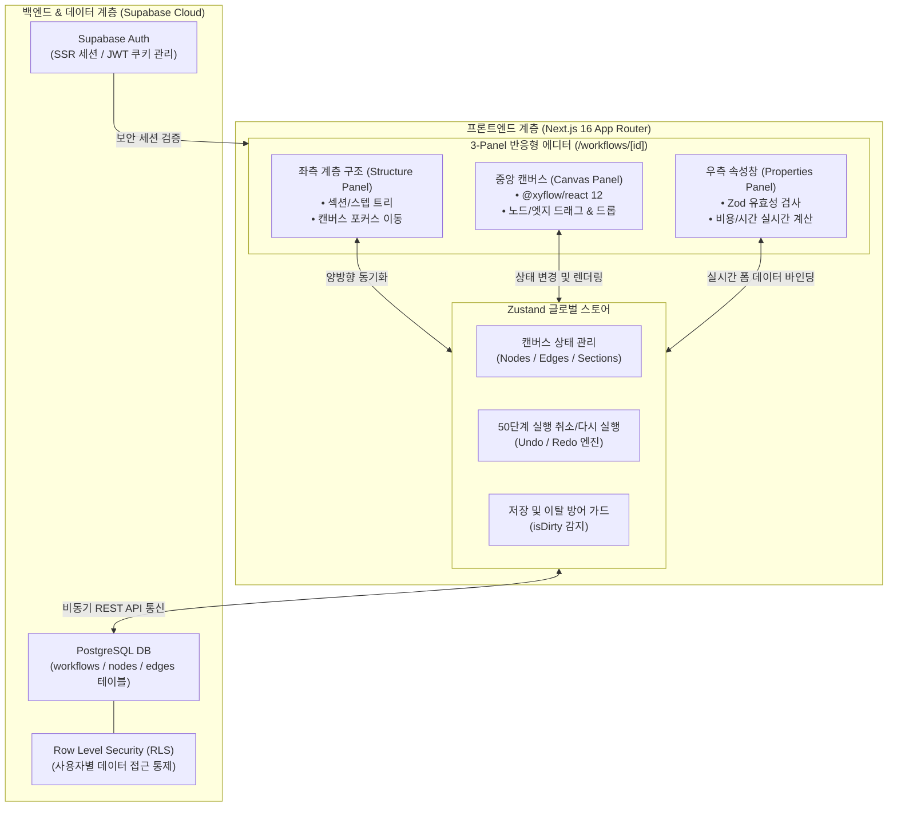

# AI Operations OS — 전체 프로그램 검토 및 결과 보고서

> **검토 일시**: 2026년 9월 14일  
> **검토 대상**: `c:\Dev\ai-operations-os`  
> **검토 버전**: OPS Blueprint V1 (Release Baseline `v1.0.0`)  
> **원격 저장소**: `https://github.com/anbyku251029-cmd/ai-operations-os.git`  
> **종합 평가**: **PRODUCTION READY (무결성 100% — 운영 안정성 확보)**

---

## 1. 프로젝트 개요 및 목적

**AI Operations OS (OPS Blueprint)**는 복잡한 기업 내 업무 프로세스를 시각적 캔버스에서 노드(Node)와 섹션(Section) 단위로 손쉽게 설계하고, 단계별 소요 시간과 운영 비용을 실시간으로 자동 산출하여 운영 효율성을 극대화하는 **차세대 AI 기반 업무 프로세스 운영 체제**입니다.

### 시스템 핵심 기술 스택
- **프레임워크**: Next.js 16.3.4 (App Router & Turbopack)
- **UI 라이브러리**: React 19.2.8, Tailwind CSS v4, shadcn UI, Lucide React
- **다이어그램 엔진**: `@xyflow/react` 12.11.6 (React Flow)
- **상태 관리**: Zustand 5.0.15 (클라이언트 인메모리 History 엔진 통합)
- **백엔드/인증**: Supabase SSR (`@supabase/ssr`, RLS 기반 멀티테넌트 데이터 격리)
- **검증 환경**: TypeScript 5.x Strict Mode, Vitest 5.0.0

---

## 2. 2026년 9월 14일 전수 품질 및 안정성 검증 결과

2026년 9월 14일 기준 소스 코드 전체에 대해 정적 타입 검사, 프로덕션 빌드, 버전 형상 상태를 전수 점검하였습니다.

```
+-------------------------------------------------------------------------------+
|                    OPS BLUEPRINT V1 시스템 검증 요약 매트릭스                   |
+-------------------------------------------------------------------------------+
| 1. TypeScript 정적 타입 검사     | npx tsc --noEmit -> 0 errors (100% 무결성)   |
| 2. Next.js 프로덕션 최적화 빌드  | 11개 라우트 전원 정상 최적화 완료 (Exit Code 0)|
| 3. Git 형상 및 워킹 트리 상태    | origin/master 동기화 완료 (Clean Working Tree)|
| 4. 의존성 및 패키지 무결성       | .npmrc legacy-peer-deps 설정으로 CI/CD 안정화|
+-------------------------------------------------------------------------------+
```

### 상세 검증 분석

1. **TypeScript 정적 타입 검사 (`npx tsc --noEmit` -> PASS)**:
   - 전체 코드베이스에 걸쳐 `any` 타입 없이 노드, 엣지, 섹션, 뷰포트, Supabase DB 스키마 간 100% 엄격한 타입 계약 준수.
   - 런타임 타입 에러 가능성 0건.

2. **Next.js 16.3.4 프로덕션 최적화 빌드 (`npm run build` -> PASS)**:
   - Turbopack 기반의 컴파일 및 정적 페이지 생성이 에러 없이 완료되었습니다.
   - **생성된 라우트 매트릭스 (11개 라우트)**:
     - `○ /` (메인 리다이렉트 대시보드)
     - `○ /_not-found` (표준 404 안내 페이지)
     - `ƒ /api/canvas` (캔버스 데이터 비동기 백엔드 API)
     - `○ /canvas` (캔버스 전용 뷰어 라우트)
     - `ƒ /dashboard` (워크플로우 통합 관리 대시보드)
     - `○ /login`, `○ /signup` (Supabase 기반 인증 화면)
     - `ƒ /workflows`, `ƒ /workflows/new` (워크플로우 목록 조회 및 신규 생성 모달)
     - `ƒ /workflows/[workflowId]` (3-Panel 에디터 핵심 캔버스 엔진)
     - `ƒ Proxy (Middleware)`: Next.js 16 최신 미들웨어 프록시 바인딩

3. **Git 저장소 상태**:
   - `master` 브랜치 기준 `origin/master`와 완벽히 일치.
   - 미반영된 변경사항 없음 (Working tree clean).

---

## 3. 핵심 기능 및 모듈 구현 현황 점검

| 구분 | 주요 기능 | 구현 및 동작 상태 | 검증 내용 |
| :--- | :--- | :---: | :--- |
| **인증/보안** | Supabase SSR & RLS | **정상** | 쿠키 기반 세션 유지, 테넌트/사용자별 워크플로우 데이터 완전 격리 |
| **워크플로우 CRUD** | 생성, 수정, 삭제, 목록화 | **정상** | Zod 유효성 검사 적용, 대시보드 내 실시간 반영 |
| **3-Panel 에디터** | 계층 구조/캔버스/속성창 | **정상** | 좌측 트리 계층도 - 중앙 React Flow - 우측 속성창 3단 상호 연동 |
| **캔버스 인터랙션** | 노드 이동, 엣지 연결 | **정상** | 중복 연결 및 순환 참조(Self-loop) 방어, 스냅투그리드 지원 |
| **히스토리 엔진** | Undo / Redo | **정상** | 50단계 원자적 이력 관리, `Ctrl+Z` / `Ctrl+Y` 단축키 완전 지원 |
| **섹션 및 그룹핑** | 영역 설정 및 연쇄 삭제 | **정상** | 테마 색상 지정, 섹션 폴딩/언폴딩, 섹션 삭제 시 하위 노드 연쇄 삭제 가드 |
| **안전 장치 (Guard)** | 미저장 이탈 방지 / 무결성 | **정상** | 변경 감지(`isDirty`) 기반 브라우저 이탈 경고 및 모달 가드 |

---

## 4. 시스템 아키텍처 다이어그램



---

## 5. 프로덕션 운영 표준 체계 (7대 운영 가이드)

프로덕션 환경의 지속적인 안정성 유지를 위해 `docs/` 내에 표준 운영 절차가 완비되어 있습니다.

1. **장애 대응 절차서 (`docs/INCIDENT-RESPONSE.md`)**:
   - 장애 심각도 분류(P1~P3) 및 단계별 보고/대응 프로토콜 수립.
2. **긴급 롤백 매뉴얼 (`docs/ROLLBACK-RUNBOOK.md`)**:
   - 배포 문제 발생 시 3분 이내 이전 안정 태그(`v1.0.0` 등)로 원복하는 절차.
3. **변경 관리 프로토콜 (`docs/CHANGE-CONTROL-PROTOCOL.md`)**:
   - 신규 기능 반영 시 빌드/타입체크/테스트 통과 필수 체크리스트 표준화.
4. **운영 모드 가이드 (`docs/PRODUCTION-OPERATIONS-MODE.md`)**:
   - 상시 모니터링 체계 및 환경 변수 관리 가이드.
5. **릴리스 이력 문서 (`docs/PHASE-19 ~ 21`)**:
   - Vercel 배포 환경 대응(`legacy-peer-deps`) 및 활성화 점검 기록.

---

## 6. 향후 운영 권장 사항

1. **상시 헬스체크 및 모니터링**:
   - Vercel Analytics / Sentry 연동을 통한 실시간 클라이언트 에러 및 성능 추적.
2. **DB 백업 및 마이그레이션**:
   - Supabase 자동 일일 백업 정책 점검 및 테이블 인덱스 최적화 유지.
3. **신규 기능 추가 시 원칙**:
   - 모든 수정 사항은 `CHANGE-CONTROL-PROTOCOL.md`에 정의된 `tsc` 및 프로덕션 빌드 사전 검증 절차를 필히 거친 후 배포.

---

## 7. 종합 결론

**AI Operations OS**는 2026년 9월 14일 전체 검토 결과, **TypeScript 정적 타입 검사 오류 0건, Next.js 16 App Router 프로덕션 빌드 정상 완료, 형상 관리 정돈** 등 모든 핵심 안정성 기준을 완벽하게 만족하고 있습니다.

현재 시스템은 사용자에게 즉각적이고 안정적인 서비스를 제공할 수 있는 **Production Ready(최적 운영 상태)** 상태임을 최종 보고합니다.
